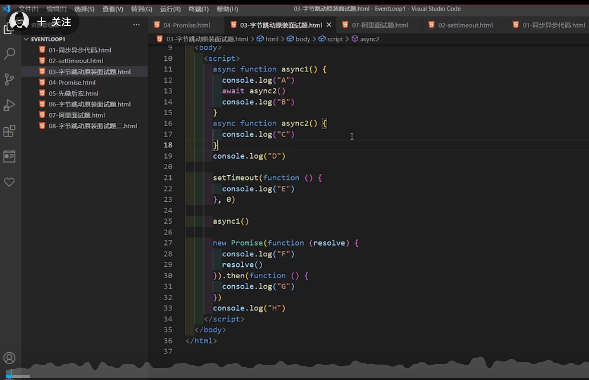
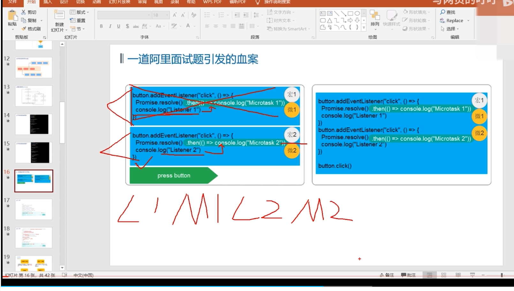

## JS：事件循环、事件队列、宏任务、微任务

浏览器是多线程，js是异步单线程

* 常驻线程
  * GUI渲染线程（DOM/BOM）
  * JS引擎线程
  * 浏览器事件线程（onclick）

* 即用即存在
  * 定时器触发线程
  * http异步线程
  * EventLoop（事件循环）处理线程

### 先同步后异步

> JS代码执行时，先执行同步任务，并将异步任务放入对应的线程中，并在一定的时间后放入任务队列，然后依次执行


### 常见的宏任务与微任务

> 异步任务中分为宏任务与微任务


### 微任务：async,await,Promise

> async,await本质是Promise的一个语法糖，两者之间是转换

* promise
  * 可链式调用
  * .then()为真正的微任务
  * .catch捕捉错误
  * .finally清理

* async,await
  * async定义异步函数，await为真正的微任务


### EventLoop(事件循环)完整流程


* 需要特别注意的是，一定是**在主线程中的同步任务执行完毕**，才会去事件队列中轮询查看是否有异步任务，如果有，遵从**先微后宏**执行

### 补充知识

* console.time方法是开始计算时间，console.timeEnd是停止计时，输出脚本执行的时间。
```javascript
// 启动计时器
console.time('testForEach');

// (写一些测试用代码)

// 停止计时，输出时间
console.timeEnd('testForEach');

// 4522.303ms
```

### 常见大厂题型与题解

* 第1题


* 第2题


* 第3题




### 参考链接
[异步编程: Promise, async, await](https://www.bilibili.com/video/BV1WP4y187Tu?spm_id_from=333.337.search-card.all.click&vd_source=c37ed8384b0191a4604cd90b8a2d5a97)

[字节前端面试真题解析同步异步编程](https://www.bilibili.com/video/BV1GV411s7G6?p=4&spm_id_from=pageDriver&vd_source=c37ed8384b0191a4604cd90b8a2d5a97)